# Roteiro 4 - Integração com Telegram e CloudWatch

## Cyber Segurança em Nuvem 2024.1

### Grupo: Antônio Martins, Ariel Leventhal e Enricco Gemha

## Introdução

Este roteiro tem como objetivo melhorar as medidas de segurança do ambiente nuvem da ABCPLACE, através da utilização de ferramentas como o Zabbix e Wazuh, que irão ser integrados com o Telegram, para envio de alertas, e com o CloudWatch, para monitoramento de logs.

## 1. Integração com Telegram

### 1.0 Criação de Bot no Telegram

Para a integração do Zabbix com o Telegram, é necessário criar um bot no Telegram, utilizando o serviços do BotFather, que irá fornecer um token de acesso para o bot.

Com o bot criado, o mesmo deverá ser adicionado a um grupo de Telegram com os Administradores do Sistema, neste caso, os integrantes do grupo.

### 1.1 Configuração do Zabbix

#### 1.1.0 Criação de Media Types

Para a integração do Zabbix com o Telegram, é necessário criar um novo tipo de mídia, que irá permitir o envio de mensagens para o Telegram.

É importante destacar que o Token utilizado é o mesmo token recebido pelo BotFather, e o `To` é referente ao identificador único do grupo de Telegram.

Para verificar se a integração foi feita corretamente, é possível enviar uma mensagem de teste.

#### 1.1.1 Adição de Media em Usuário Administrador

Será configurado no usuário administrador do Zabbix a nova mídia criada.

#### 1.1.2 Zabbix Actions

Para que o Zabbix envie mensagens para o Telegram, é necessário criar uma nova ação, que irá ser acionada quando um alerta for disparado.

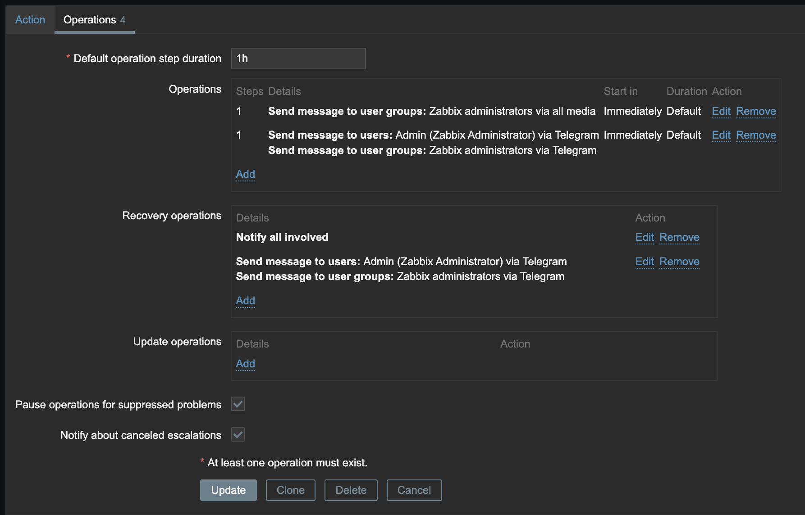

### 1.1.3 Teste de Integração com Telegram

Para testar a integração com Telegram, serão deslizadas a máquina do MySql, que irá disparar um alerta no Zabbix.

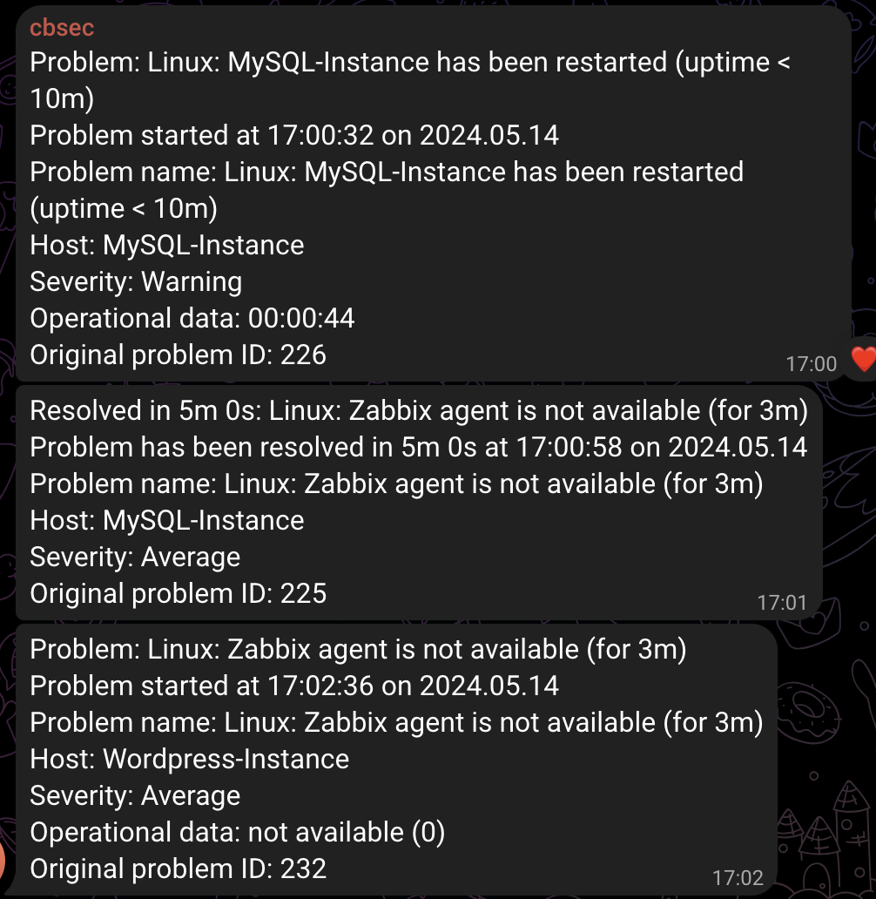

Com isso é possível verificar que os alertas estão funcionando, no decorrer desta atividade, foram feitos outros testes, com outras instâncias, o que gerou outros alertas:

## 2. Integração com CloudWatch

### 2.1 Configuração do CloudWatch para o Wazuh

Conforme solicitado, instalou-se e configurou-se os agentes do CloudWatch para enviar logs das instâncias ao serviço titular. Verifica-se isto nas screenshots a seguir:

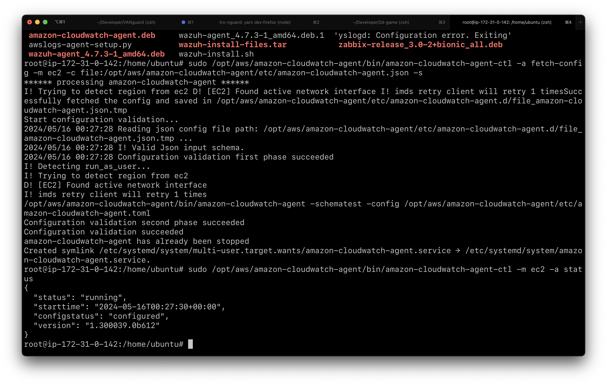

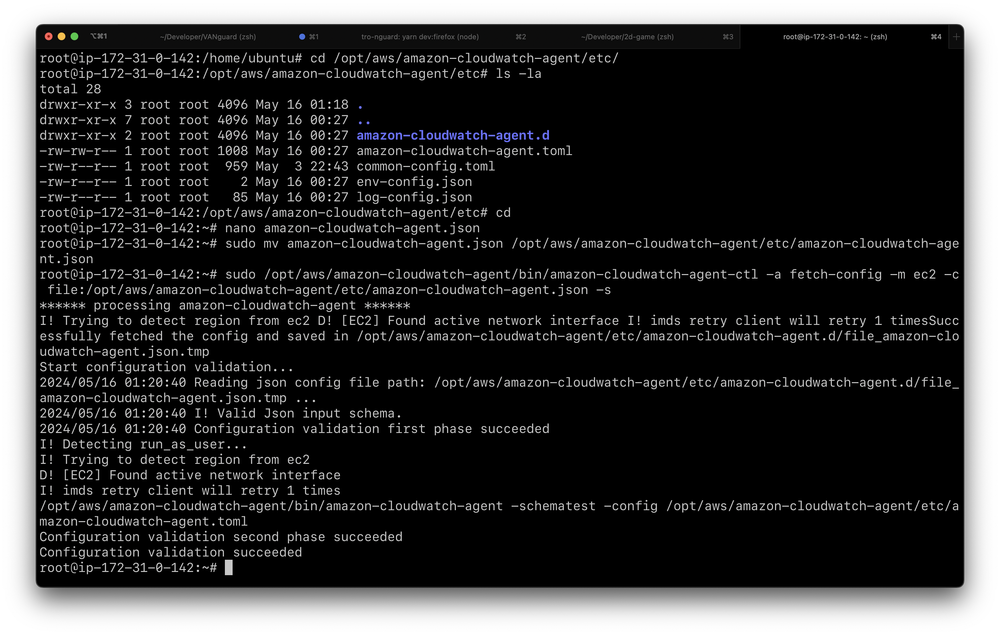

### 2.2 IAM para o CloudWatch

Concedeu-se permissão ao user group `abc-place` para acessar todos os logs do CloudWatch, como visto na imagem abaixo.

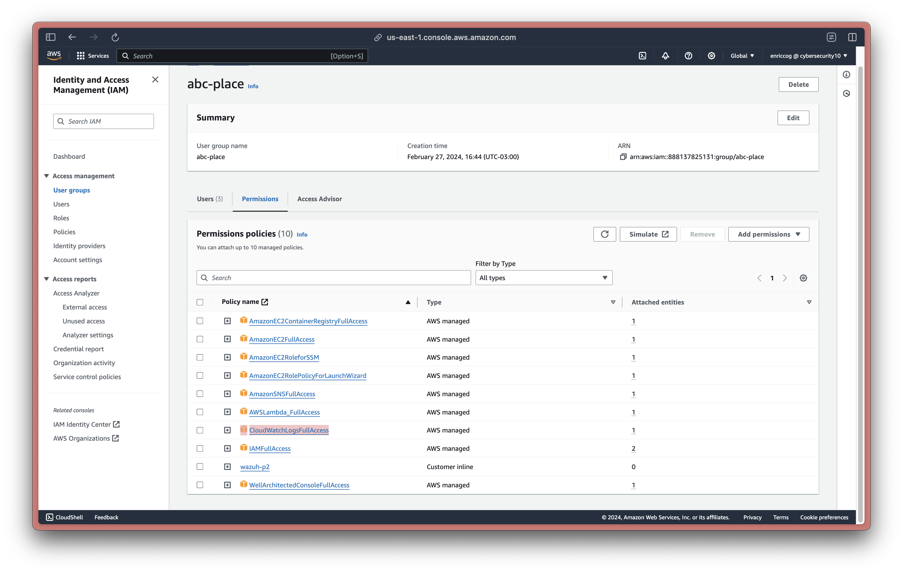

### 2.3 Métricas e filtros no CloudWatch para tentativas de autenticação SSH (sucesso ou falha)

Comecou criando-se o log group `auth-logs`, que recebe os logs vindos de todos os agentes do CloudWatch.

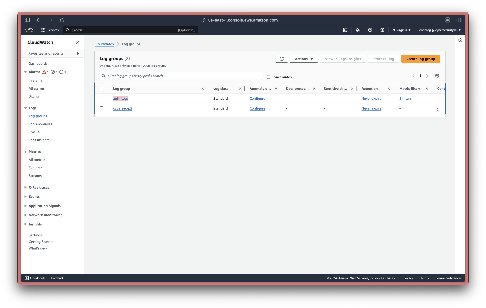

Criaram-se duas métricas associadas a `auth-logs`. Um deles reconhece padrões de logins SSH bem-sucedidos nos logs, enquanto o outro reconhece tentativas falhas.

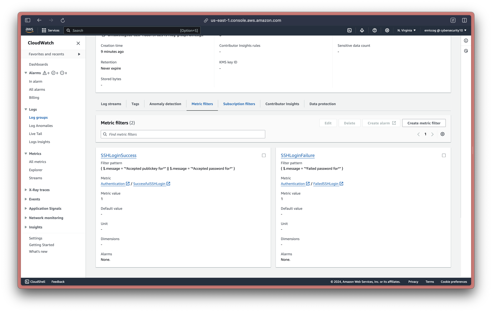

### 2.4 Alarme no CloudWatch para tentativas de autenticação SSH

Definiu-se um tópico SNS (Simple Notification Service), atrelado a *cbsec10@gmail.com*, que fará a notificação via e-mail dos alarmes, como se atesta abaixo:

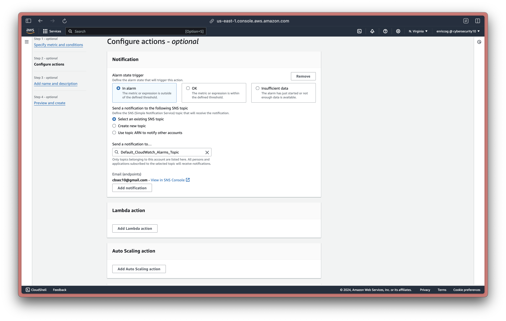

Em seguida, configuram-se propriamente os alarmes, um disparando após 3 tentativas falhas dentro de uma janela de 5 minutos, e outro a cada 1 tentativa bem-sucedida de autenticação.

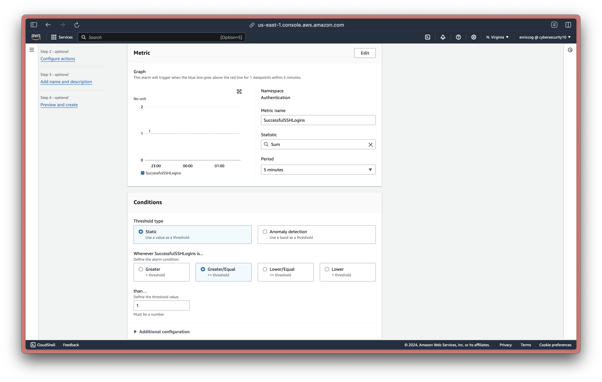

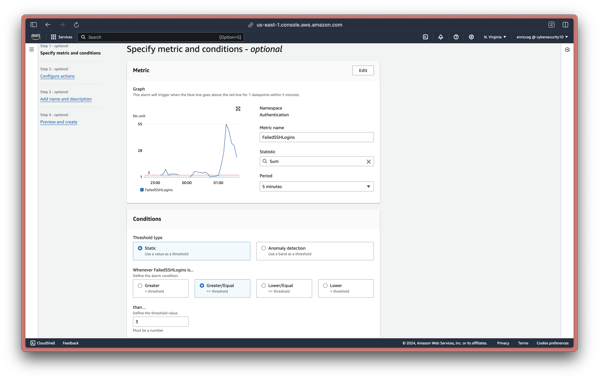

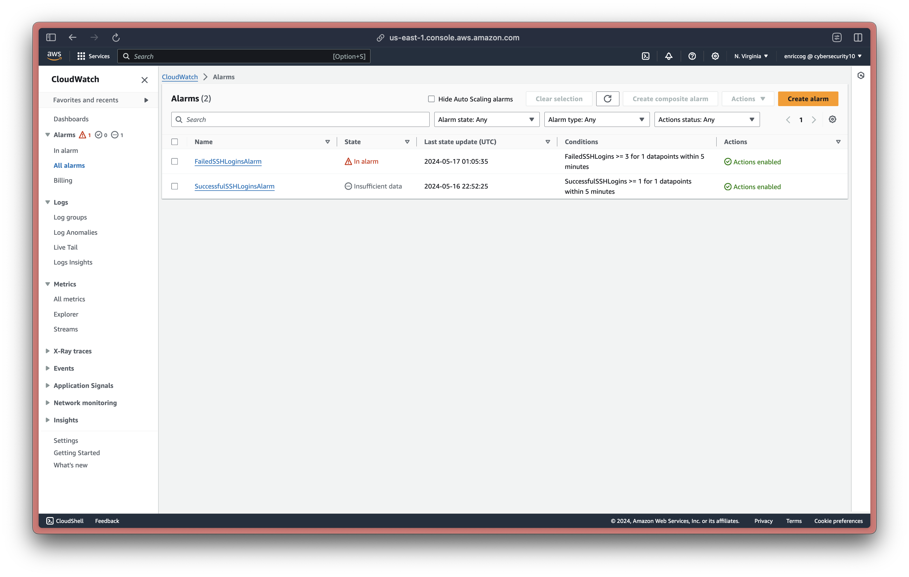

Com isso, pode-se observar nos gráficos o fluxo de tentativas, bem e mal-sucedidas.

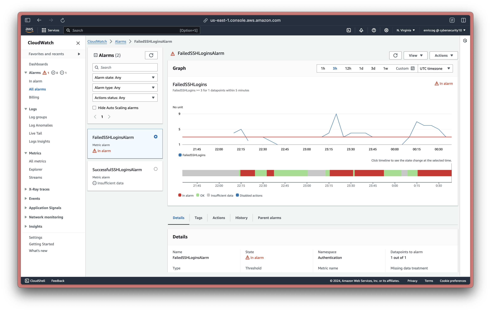

Por fim, confirmou-se o funcionamento do serviço de notificação via e-mail, para ambos os casos, como é mostrado abaixo:

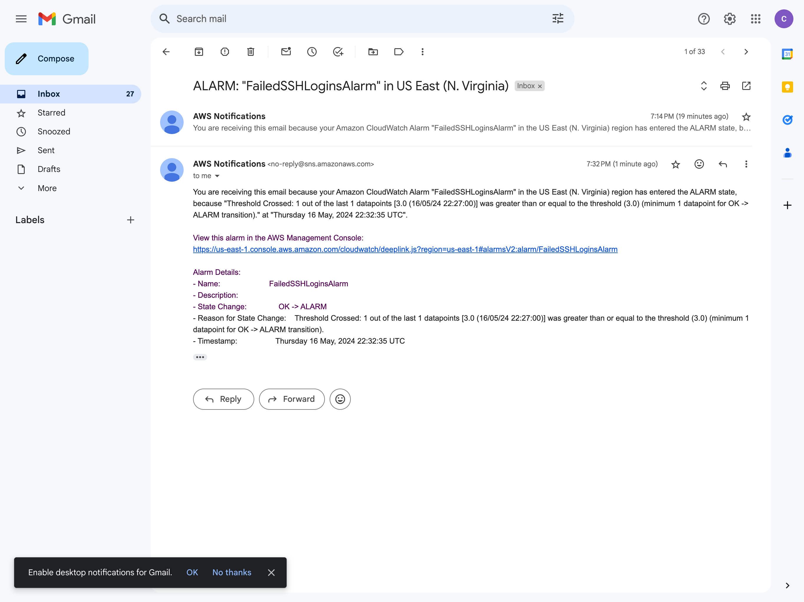

## 3. Integração do Zabbix com Email

### 3.0 Configuração do Servidor SMTP

Para a integração com o servidor SMTP, foi utilizado o serviço da A2C Solutions, hospedado no endereço `mail.a2csolutions.com.br`, com a porta `465` para envio de mensagens.

### 3.1 Configuração de Media Type

Foi criada um Media Type específico para envio de mensagens por email, com as configurações do servidor SMTP, e o email de destino, com o nome `cbsecsmtp`.

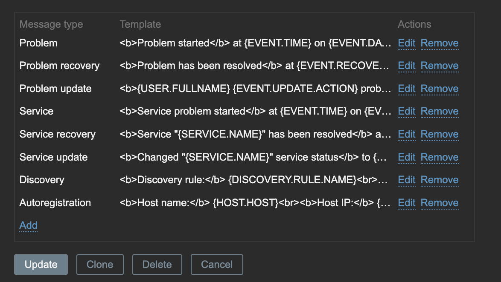

### 3.2 Configuração de Usuário

Como descrito nos passos da atividade, há a necessidade de se criar um usuário apenas para o envio de email. 

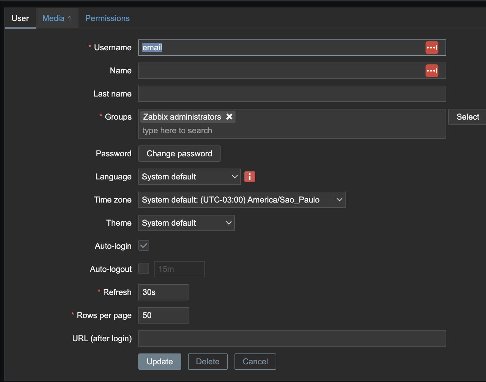

Para este usuário conseguir realizar o envio de emails e ter acesso a actions, há a necessidade de dar a ele permissões de superadmin, e alterar sua Media.

### 3.3 Configuração de Ação

Para que o Zabbix envie emails, é necessário criar uma nova ação, que irá ser acionada quando um alerta for disparado.

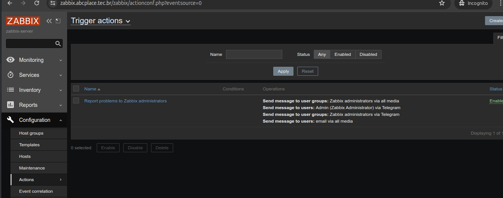